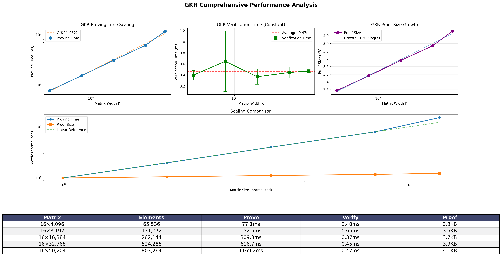

# Nova AI - GKR Zero-Knowledge Proofs

High-performance implementation of GKR (Generalized Knight's Rook) zero-knowledge proofs for matrix-vector multiplication verification. Proves that `y = W·x` for private weight matrix `W` and public input/output vectors `x,y`.

## Architecture

Nova AI consists of three main components:

- **`zk_gkr/`** - Core GKR protocol implementation with sum-check, Merkle commitments, and Fiat-Shamir transcript
- **`nova_poc/`** - Command-line interface for proof generation, verification, and benchmarking
- **`zk_gkr_accel/`** - High-performance acceleration backends with CPU AVX2/AVX-512 and CUDA GPU support

## Performance

Current benchmarks on Apple Silicon M-series CPU (16×K matrices):



**Key characteristics:**
- **Near-linear proving time**: O(K^1.05) scaling up to 50K matrices
- **Constant verification**: ~0.40ms regardless of matrix size
- **Compact proofs**: 2.9KB → 4.1KB across 49× size increase
- **Production scale**: 50K matrix proof in 1.2 seconds

## Quick Start

### Standard GKR Implementation

```bash
# Build the project
cargo build --release

# Run demo (16×4096 matrix)
./target/release/nova_poc demo

# Generate custom proof
./target/release/nova_poc prove --weights1-path data/weights.bin --x0-path data/input.bin --m 16 --k 8192

# Verify a proof
./target/release/nova_poc verify --proof-path gkr_out/gkr_proof.bin --public-path gkr_out/public.json

# Run benchmarks
./target/release/nova_poc benchmark --sizes 1024,2048,4096 --repeats 3
```

### Accelerated Backends

#### CPU AVX2/AVX-512 Acceleration

```bash
# Build with CPU AVX acceleration
cargo build --release --features accel_cpu_avx

# Generate proof with CPU AVX backend
./target/release/nova_poc prove --weights1-path data/weights.bin --x0-path data/input.bin \
  --m 16 --k 8192 --accel --accel-backend cpu_avx --accel-threads 8

# Test CPU AVX functionality
cargo test -p zk_gkr_accel --features cpu_avx

# Run benchmarks comparing backends
cargo bench -p zk_gkr_accel --features cpu_avx
```

#### CUDA GPU Acceleration

```bash
# Build with CUDA acceleration (requires CUDA toolkit)
cargo build --release --features accel_cuda

# Generate proof with CUDA GPU backend
./target/release/nova_poc prove --weights1-path data/weights.bin --x0-path data/input.bin \
  --m 16 --k 8192 --accel --accel-backend cuda --accel-device-id 0

# Test CUDA functionality (if hardware available)
cargo test -p zk_gkr_accel --features cuda

# Run benchmarks with CUDA
cargo bench -p zk_gkr_accel --features cuda
```

#### All Acceleration Backends

```bash
# Build with all acceleration features
cargo build --release --features accel_all

# Check available backends on your system
cargo run --bin nova_poc --features accel_all -- prove --help

# Run all acceleration tests
cargo test -p zk_gkr_accel --features all_backends
```

#### Backend Selection

The acceleration backend is automatically selected based on:
1. **CPU AVX**: Available on x86_64 with AVX2 support, fallback on other architectures
2. **CUDA**: Only available if CUDA drivers and hardware are detected
3. **Standard**: Always available as fallback

Check available backends programmatically:
```bash
# View available acceleration backends
./target/release/nova_poc prove --accel --help
```

## Security

See [`ANALYSIS.md`](ANALYSIS.md) for detailed security analysis.

## Advanced Benchmarking

For comprehensive performance analysis with visualization:

```bash
# Standard benchmark with plots
python3 scripts/benchmark.py --sizes 4096,8192,16384 --repeats 3

# CPU AVX2/AVX-512 accelerated benchmark
python3 scripts/benchmark.py --avx --sizes 4096,8192,16384 --repeats 3

# CUDA GPU accelerated benchmark
python3 scripts/benchmark.py --cuda --sizes 4096,8192,16384 --repeats 3
```

The benchmark script generates:
- **CSV data**: Raw timing and performance metrics
- **PNG plots**: Comprehensive performance visualization with baseline comparison
- **Overhead analysis**: Shows ZK proving cost vs pure matrix multiplication

## Scripts

See [`scripts/README.md`](scripts/README.md) for details about scripts.

## Development

### Building

```bash
# Standard build
cargo build --release

# With CPU acceleration
cargo build --release --features accel_cpu_avx

# With CUDA acceleration (requires CUDA toolkit)
cargo build --release --features accel_cuda

# With all acceleration backends
cargo build --release --features accel_all
```

### Testing

```bash
# Test core GKR implementation
cargo test --workspace

# Test CPU AVX acceleration
cargo test -p zk_gkr_accel --features cpu_avx

# Test CUDA acceleration (if hardware available)
cargo test -p zk_gkr_accel --features cuda

# Test all acceleration backends
cargo test -p zk_gkr_accel --features all_backends

# Run integration tests
cargo test --all --features accel_all
```

### Benchmarking

```bash
# Benchmark standard implementation
cargo bench -p nova_poc

# Benchmark CPU AVX acceleration
cargo bench -p zk_gkr_accel --features cpu_avx

# Benchmark CUDA acceleration
cargo bench -p zk_gkr_accel --features cuda

# Compare all backends
cargo bench --all --features accel_all
```

### Code Quality

```bash
1. Format: cargo fmt --all
2. Lint: cargo clippy --all-targets --all-features
3. Check: cargo check --all --all-features
```
