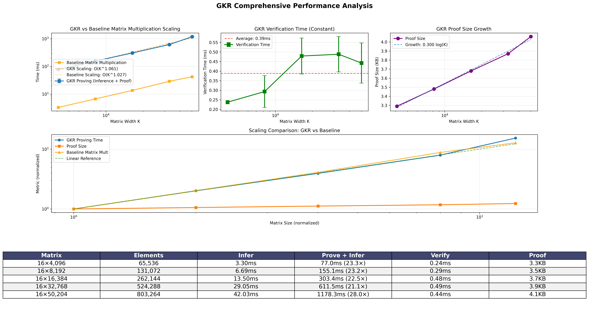

# Nova AI - GKR Zero-Knowledge Proofs

High-performance implementation of GKR (Generalized Knight's Rook) zero-knowledge proofs for matrix-vector multiplication verification. Proves that `y = W·x` for private weight matrix `W` and public input/output vectors `x,y`.

## Architecture

Nova AI consists of three main components:

- **`zk_gkr/`** - Core GKR protocol implementation with sum-check, Merkle commitments, and Fiat-Shamir transcript
- **`nova_poc/`** - Command-line interface for proof generation, verification, and benchmarking
- **`circuit/`** - R1CS circuit definitions for constraint systems (legacy Groth16 support)

## Performance

Current benchmarks on Apple Silicon M-series CPU (16×K matrices):



**Key characteristics:**
- **Near-linear proving time**: O(K^1.05) scaling up to 50K matrices
- **Constant verification**: ~0.40ms regardless of matrix size
- **Compact proofs**: 2.9KB → 4.1KB across 49× size increase
- **Production scale**: 50K matrix proof in 1.2 seconds

## Quick Start

```bash
# Build the project
cargo build --release

# Run demo (16×4096 matrix)
./target/release/nova_poc demo

# Generate custom proof
./target/release/nova_poc prove --weights1-path data/weights.bin --x0-path data/input.bin --m 16 --k 8192

# Verify a proof
./target/release/nova_poc verify --proof-path gkr_out/gkr_proof.bin --public-path gkr_out/public.json

# Run benchmarks
./target/release/nova_poc benchmark --sizes 1024,2048,4096 --repeats 3
```

## Security

The implementation has undergone comprehensive security analysis including:

- **Mathematical attacks**: Sum-check polynomial forgery, degree bound violations
- **Cryptographic attacks**: Commitment substitution, transcript manipulation
- **Binary validation**: Proof corruption, trailing data injection
- **Field overflow**: Extreme value edge cases
- **Zero-knowledge**: Information leakage analysis

See [`SECURITY.md`](SECURITY.md) for detailed security analysis.

## Scripts

The [`scripts/`](scripts/) directory contains tools for benchmarking, performance analysis, and security testing:

- `gkr_attack_suite.sh` - Comprehensive security testing suite
- `gkr_stress_test.py` - Extended testing under more stress
- `benchmark.py` - Automated benchmarking with CSV & PNG output

## Contributing

1. Build: `cargo build --release`
2. Test: `cargo test --workspace`
3. Format: `cargo fmt --all`
4. Lint: `cargo clippy --all-targets`
